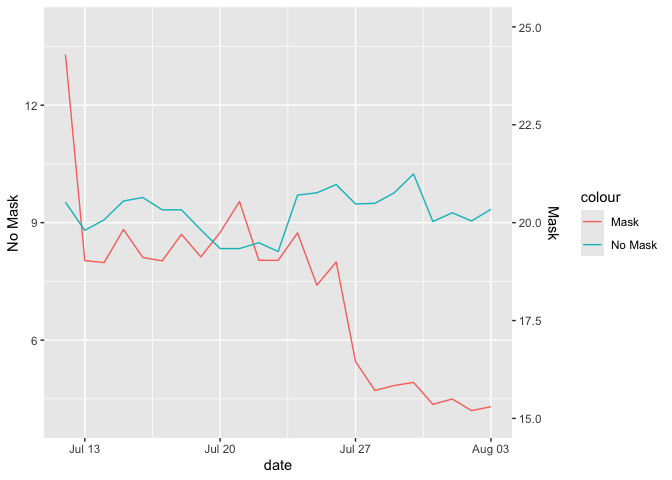
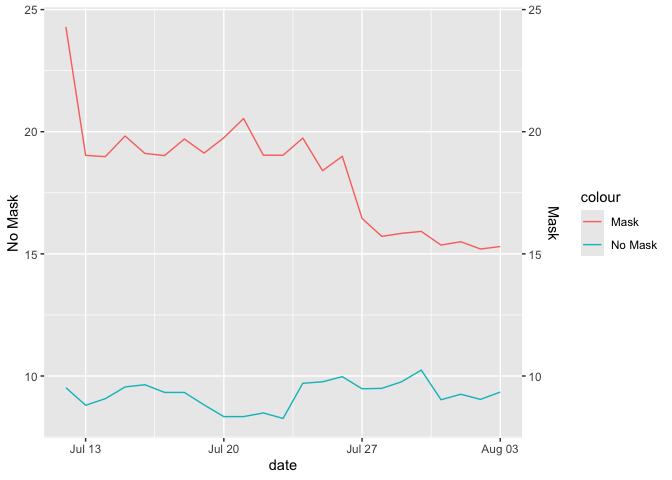
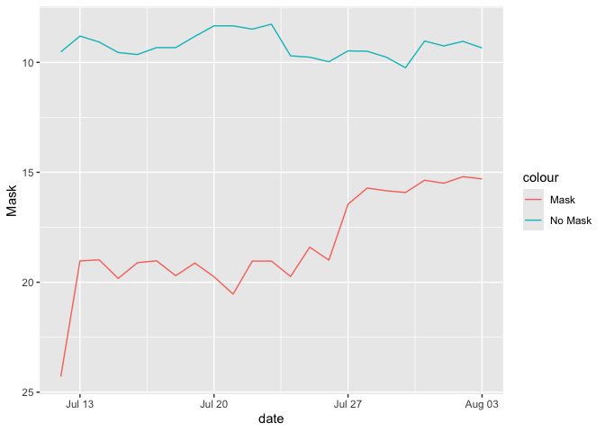
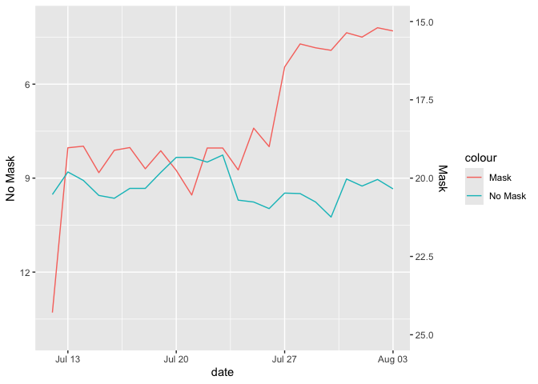

Lab 07 - Conveying the right message through visualisation
================
Thomas Huang
2026-02-23

### Load packages and data

``` r
library(tidyverse) 
```

### Exercise 1

``` r
df <- read_csv("kansas_grouped_rolling_avg.csv")
```

    ## Rows: 46 Columns: 3
    ## ── Column specification ────────────────────────────────────────────────────────
    ## Delimiter: ","
    ## chr  (1): mask_mandate
    ## dbl  (1): rolling_avg
    ## date (1): date
    ## 
    ## ℹ Use `spec()` to retrieve the full column specification for this data.
    ## ℹ Specify the column types or set `show_col_types = FALSE` to quiet this message.

``` r
# Convert long to wide
df_wide <- df %>%
  mutate(mask_mandate = str_replace_all(mask_mandate, " ", "_")) %>% 
  pivot_wider(
    names_from = mask_mandate,
    values_from = rolling_avg
  )

ggplot(df_wide, aes(x = date))+
  geom_line(aes(y = Mask - 11, color = "Mask")) +
  geom_line(aes(y = No_Mask, color = "No Mask")) +
  scale_y_continuous(
    name = "No Mask", limits = c(4, 14),
    sec.axis = sec_axis(~. + 11, name = "Mask")
  )
```

<!-- -->

### Exercise 2

``` r
ggplot(df_wide, aes(x = date))+
  geom_line(aes(y = Mask, color = "Mask")) +
  geom_line(aes(y = No_Mask, color = "No Mask")) +
   scale_y_continuous(
    name = "No Mask",
    sec.axis = sec_axis(~ . , name = "Mask")
  )
```

<!-- -->

### Exercise 3

Mask mandate predicts fewer daily cases. Counties without mask mandate
demonstrated a steady trend of daily cases.

### Exercise 4

Wear a mask protects people from getting Covid.

### Exercise 5

I chose a line chart to visualize the trend. My visualization used the
same scale for counties with and without mask mandates, which makes the
trend comparable.

### Exercise 6

My misleading visualization aim to show wearing masks actually predicted
more cases. I plan to challenge the audience’s common sense. Normally,
people would assume the axes are positive or increasing. That is,
coordinates higher on the y-axis represents larger values. I am going to
flip the y-axis.

### Exercise 7

``` r
ggplot(df_wide, aes(x = date))+
  geom_line(aes(y = Mask, color = "Mask")) +
  geom_line(aes(y = No_Mask, color = "No Mask")) +
   scale_y_reverse()
```

<!-- -->

``` r
# Now I would tweak the scale anchors to make the no mask condition first intersect and then surpass the mask condition.
ggplot(df_wide, aes(x = date))+
  geom_line(aes(y = Mask - 11, color = "Mask")) +
  geom_line(aes(y = No_Mask, color = "No Mask")) +
  scale_y_reverse(
    name = "No Mask", limits = c(4, 14),
    sec.axis = sec_axis(~. + 11, name = "Mask")
  )
```

<!-- -->
